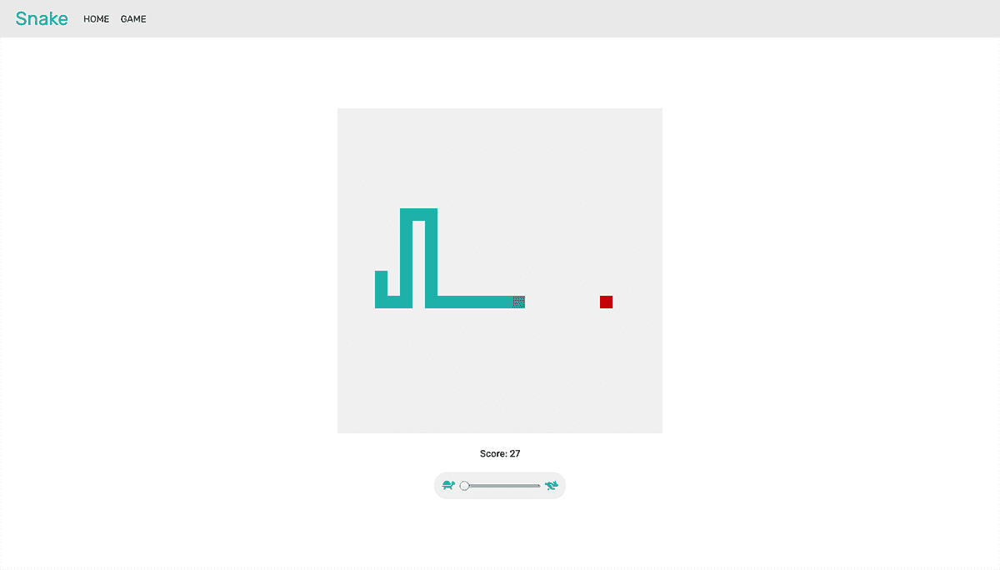

# Snake

The classic 70s arcade game built with React, Typescript, and RxJS.

### Description

Snake is a relatively simple game wherein the player controls a "snake" that moves around the game
board according to the players input. The player is able to eat "apples", which increase the score
by 1, as well as increase the size of the snake by 1 unit. The goal of the game is to achieve the
highest score possible. The game ends if the player runs into a wall, or themselves.

### Challenges

1. **Handling player input**: Player input can come from either touching/clicking on the direction
   on the game board in which you want to move the snake, or by pressing the WASD or arrow keys on
   the keyboard. To easily manage this, all player input is captured as a stream of input (RxJS),
   and then mapped to a "direction" value of either Up, Left, Down, or Right. Every time the a
   render step occurs, the current direction is passed in to the state reducer, which determines how
   to move the snake.

2. **State management**: The game needs do several things on each game render; it must check for any
   collisions, render the snake movement from the given player direction (given as a state reducer action
   payload), and check if the snake has "eaten" an apple, increasing the score by 1, length of the
   snake by 1, and randomizing the apple to a new location.

3. **Efficient collision checking**: To be efficient about checking for collisions, only the head of the snake
   is checked, as to avoid having to check every part of the snake, as the rest of the snake follows
   the head.

4. **Efficient game rendering**: To be efficient about rendering the snake, only the snake grid
   points themselves get rendering, as to avoid redundently rendering every point on the grid.

5. **Render steps**: The game needs to render at a constant pace at which the player moves on each
   step. The player is also able to control the rate of the render steps, which is achieved by
   mapping a slider and its value to a Subject stream of its values. This slider value is then
   switch mapped to an interval of constant render steps, which then dispatches an action to move
   the player to the render steps.

### Technologies Used

-   React
-   React-Router
-   Styled-Components
-   TypeScript
-   RxJS
